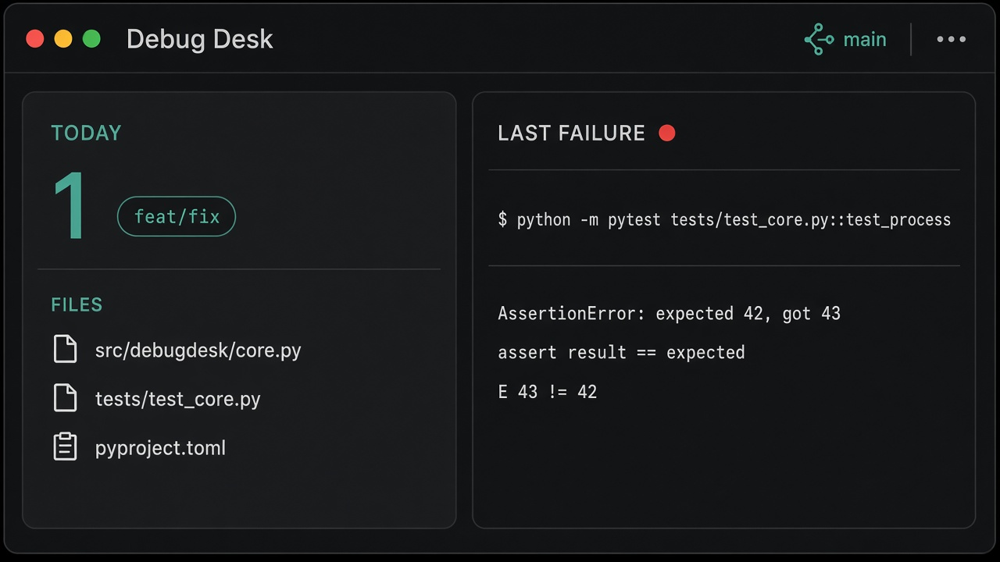

# debug-desk

Hermes plugin: **today's git digest** plus the **last failed terminal command** the agent ran. Optional summary uses the user's active model (`ctx.llm`). Desktop pane + status chip.

Does not watch VS Code, PowerShell, or any terminal outside Hermes.



## Install

```bash
hermes plugins install https://github.com/aydnOktay/hermes-debug-desk.git
hermes plugins enable debug-desk
```

Or from a local clone:

```bash
hermes plugins install .
hermes plugins enable debug-desk
```

Restart the gateway. The Desktop pane ships enabled (`defaultEnabled: true`). If you do not see it: **Capabilities → Plugins → Debug Desk**, then look at the right-hand pane and the `desk` status chip. Cmd/Ctrl+K → **Debug Desk** also works.

Unified install copies `desktop/plugin.js` into `$HERMES_HOME/desktop-plugins/debug-desk/`. On Windows that is `%LOCALAPPDATA%\hermes\desktop-plugins\debug-desk\plugin.js`.

Slash:

```
/debug-desk today
/debug-desk last
/debug-desk last summarize
```

Agent tools: `debug_daily_report`, `debug_last_failure`.

## Layout

```
plugin.yaml
__init__.py              # register() — tools, hook, slash, skill
desk_tools.py            # handlers (JSON string, never raise)
desk_hooks.py            # post_tool_call on terminal / process
desk_context.py
store.py                 # git + redacted failure state
schemas.py
skills/debug-desk/SKILL.md
dashboard/manifest.json
dashboard/plugin_api.py  # /api/plugins/debug-desk/board
desktop/plugin.js        # pane + status chip (no JSX)
```

State lives in `$HERMES_HOME/plugin-data/debug-desk/state.json`, not in the install tree.

## v1 rules

- Git report is deterministic (`git log --since=midnight`). No LLM.
- Failures: nonzero exit or traceback-like output. Last 8 lines, secrets redacted, 120s debounce.
- Status chip turns red if a failure is less than 15 minutes old.
- "Refresh summary" calls the active model; if `ctx.llm` is missing it shows the raw lines.

## Doctor

```bash
hermes plugins doctor . --ci
```
